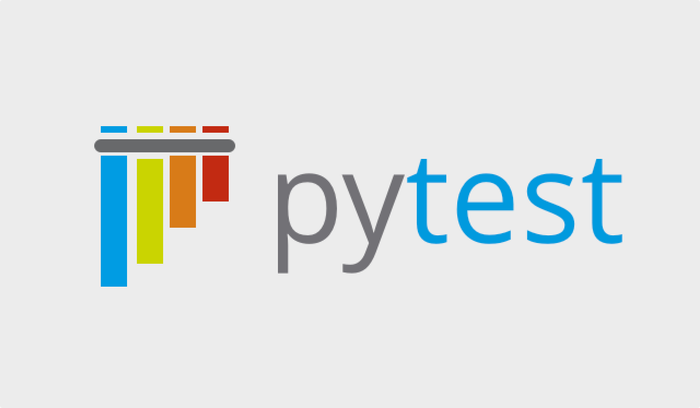

# Day 1: The Bank Account

## Initial Configuration

**Upozornenie:** Pre vytvorenie projektu nepoužívať `poetry`, ale vystačiť si len so štandardným modulom `virtualenv`. Zbytočne zdržuje pri rozličných prostrediach a pre rozličné úrovne účastníkov prináša viac problémov ako úžitku :-(

V prípade použitia _VS Code_ je potrebné nainštalovať rozšírenie:

* [Python Test Explorer](https://marketplace.visualstudio.com/items?itemName=LittleFoxTeam.vscode-python-test-adapter)


## Na úvod

* o teoretických veciach sa budeme rozprávať postupne, aby som vás zbytočne nezahltil hneď na začiatku


## Čo je to test?

> A **test is code** that runs to **check the validity** of **other code**.

Test je kód, ktorý sa spúšťa na overenie správnosti iného kódu.

Prečo by som mal testovať?

* dokázať, že kód pracuje podľa požiadaviek
* ukázať iným, ako sa váš kód dá používať
* vložiť do kódu bezpečnostnú poistku pre zmeny v budúcnosti


## Kvíz


## Príkaz `assert`

* kľúčové slovo jazyka
* Slovo `assertion` je po slovensky tvrdenie. Príkazom `assert` teda budeme overovať pravdivosť tvrdení. Tie teda môžu byť buď pravdivé alebo nepravdívé.
* ak je tvrdenie nepravdivé, príkaz skončí s výnimkou `AssertionError`


## Pytest



* samostatná knižnica, ktorá nie je súčasťou štandardnej knižnice jazyka Python
    * súčasťou štandardnej knižnice je modul `unittest`

* Guido Van Rosum povedal:

  > "Everybody is using pytest anyway…"
  > -- Guido van Rosum

* Pytest zvláda aj testy napísané pomocou modulu `unittest` alebo `nose`

* je rozšíriteľný pomocou rozličných rozšírení
  * API pre ich tvorbu
  * existujú desiatky/stovky rozšírení

inštalácia:

```bash
$ pip install pytest
```


## The Bank Account Intro

Počas tohto lab-u si vyskúšame, ako vyzerá **vývoj riadený testami** (TDD) - celý proces **Red-Green-Refactor**. V rámci lab-u budeme vytvárať testy pre objekt reprezentujúci bankový účet používateľa.

cielom bude vytvorit bankovy ucet, o ktorom budeme vediet tieto informacie:

* kazdy bankovy ucet bude mat svojho vlastnika - `.owner`
* kazdy bankovy ucet bude mat definovany IBAN - `.iban`
* kazdy bankovy ucet bude mat zostatok na ucte - `.balance`
* nad kazdym bankovym uctom bude existovat zoznam transakcii - `.transactions`

no a s uctom budeme vediet robit tieto operacie:

* vytvoriť nový bankový účet, ktorého zostatok bude priamo po vytvorení `0`
* zistiť aktuálny zostatok na účte (metóda `get_balance()`)
* vložiť na existujúci bankový účet peniaze (metóda `deposit()`)
* vybrať z existujúceho bankového účtu peniaze (metóda `withdraw()`)
* previesť peniaze z účtu na účet

Vždy však musí platiť podmienka, že výška bankového účtu musí byť vyššia ako 0. Pre jednoduchosť budú všetky hodnoty reprezentujúce množstvo peňazí na účte typu integer.


Pre popularizáciu a zjednodušenie budeme pre reprezentáciu bankového účtu používať modul [`pydantic`](https://docs.pydantic.dev/latest/).


## Red-Green-Refactor


* zivotny cyklus programovania riadeneho testami
* neustaly cyklus - uzavrety kruh, ktory nema zaciatok
* zacina sa ale fazou red - vytvorime test, ktory zlyha
* pokracuje sa fazou green - urobime minimum preto, aby test presiel
* a cyklus konci fazou refaktor, v ramci ktorej upravime kod na zaklade zmien, ktore sme vykonali

* zacneme s fazou red - vytvorime test, ktory zlyha.


## Tvorba jednoduchých testov (test cases)

Navrhnite a vytvorte test, pomocou ktorého overíte, že po vytvorení nového účtu, bude zostatok na ňom `0`.

```python
def test1():
    account = BankAccount()
    assert account.balance == 0,
        "Ballance should be 0 when account is created."
```


Test spustíme ručne. To môžeme urobiť viacerými spôsobmi:

* z príkazového riadku pomocou príkazu `pytest`:

  ```bash
  $ pytest test_bankaccount.py
  ```

* v prostredí _PyCharm_ môžeme vytvoriť spúšťač testu (aj napriek tomu, že sa pri ňom možno automagicky objaví tlačidlo na spustenie testu)
  * `Run` > `Edit Configurations...`
  * `+` (`Add New Configuration`) > `Python tests` > `pytest`
  * ako `Target` môžeme vybrať
    * `Module name` - `test_bankaccount`
    * `Script Path` - cesta k modulu

* v prostredí _VS Code_ v rozšírení `Test Explorer` určíme:
  * o aké testy sa jedná - `pytest`
  * priečinok, kde sa testy nachádzajú

Po spustení testu tento samozrejme zlyhá, nakoľko trieda `BankAccount` ako ani jej metóda `get_balance()` zatiaľ neexistujú. To je však úplne v poriadku, nakoľko sme stále vo fáze Red a vytvorili sme test, ktorý zlyhá. V nasledujúcej úlohe sa pokúsime test sprevádzkovať.


Spojazdnite test.

Aby sme test spojazdnili, musíme vytvoriť ako triedu `BankAccount`, tak aj jej metódu `get_balance()`, ktorá vráti aktuálny stav účtu. Keďže však programujeme voči testu, môže výsledná implementácia, ktorá testom prejde, vyzerať aj takto:

```python
from pydantic import BaseModel

class BankAccount(BaseModel):
    balance: int = 0
```


 Po spustení testu bude tento tentokrát zelený.


Navrhnite a vytvorte test, pomocou ktorého overíte, že ak na účet vložíte nejaký finančný obnos, tento sa na účte následne aj objaví.

 Pre vkladanie peňazí na účet budeme používať metódu `deposit()`. V rámci testu teda:


1. vytvoríme nový účet (výška účtu bude po vytvorení 0)
2. vložíme na účet 1000 eur
3. otestujeme, či sa na účte týchto 1000 eur nachádza

```python
def test_account_balance_after_thousand_euro_was_given():
   account = BankAccount()
   account.deposit(1000)
   assert account.get_balance() == 1000
```


Spustite a spojazdnite test.

Ak teraz spustíte test, tento samozrejme skončí neúspešne, keďže sa v triede `BankAccount` nenachádza metóda `deposit()`. Začneme teda jej vytvorením:

```python
def deposit(self, amount):
   self.amount = amount
```

Vo výstupe testu už tentokrát síce chyba o neexistencii metódy `deposit()` nie je, ale tentokrát sa zobrazí chyba iná - objekt typu `BankAccount` nemá atribút `balance`:

```
Error
Traceback (most recent call last):
  File "bank_account.py", line 25, in test_balance_after_some_deposit_was_given
    account.deposit(1000)
  File "bank_account.py", line 13, in deposit
    self.balance += value
AttributeError: 'BankAccount' object has no attribute 'balance'
```

Budeme preto musieť vytvoriť konštruktor, v ktorom triedu BankAccount inicializujeme - vytvoríme členskú premennú `balance` a inicializujeme ju na hodnotu `0`:

```python
def __init__(self):
   self.amount = 0
```


## Ako písať dobré testy

1. Test má byť **atomický**.
2. Jeden test vždy testuje **jednu vec**.
3. V jednom teste vždy len **jeden `assert`**.

Dodržanie týchto podmienok má za následok, že budeme vytvárať veľký počet malých testov.


## Naming Conventions

* existuje mnoho odporúčaní, ako pomenovávať testy
* odporúčam tento, ktorý vychádza z BDD:
  > when/if - then/expect


## Testovanie výnimiek

Navrhnite a implementujte test, pomocou ktorého overíte, či je možné na účet vložiť záporný obnos peňazí.

Parametrom metódy `.deposit()` môžu byť len kladné hodnoty. Vytvoríme teda test, ktorý overí tento prípad. V prípade, že dôjde k pokusu o vloženie zápornej hodnoty na účet, metóda vyvolá výnimku ValueError.

Pre otestovanie toho, či k výnimke došlo alebo nie, môžeme použiť štandardné odchytávanie výnimiek tak, ako sa robí v jazyku Python - pomocou kľúčových slov `try-except`:

```python
def test_when_negative_number_is_given_ValueError_is_thrown():
  account = BankAccount()

  try:
    account.deposit(-1000)
  except ValueError:
    return

  assert False, 'Exception VallueError did not raise.'
```


Ak teraz spustíme test, samozrejme zlyhá, keďže metóda `deposit()` žiadnu výnimku nevyvolá:

```
F
bank.py:41 (test_when_deposit_is_negative_then_valueerror_exception_is_thrown)
def test_when_deposit_is_negative_then_valueerror_exception_is_thrown():
        # when
        account = BankAccount()

        # then
        with pytest.raises(ValueError):
>           account.deposit(-100)
E           Failed: DID NOT RAISE <class 'ValueError'>

bank.py:48: Failed
```

Aktualizujeme teda aj samotnú metódu `deposit()`, aby aj tento test prešiel:

```python
def deposit(self, value):
   if value < 0:
      raise ValueError('Amount must be greater than 0')
   self.balance += value
```


Uvedený test je však možné zapísať aj pomocou context manager-u. Takto upravený test vyzerá nasledovne:

```python
def test_when_negative_number_is_given_ValueError_is_thrown():
   account = BankAccount()
   with pytest.raises(ValueError):
      account.deposit(-1000)
```


## Parametrické testy

Vytvorte test, pomocou ktorého otestujete, že ak bude parametrom reťazec, dôjde k vyvolaniu výnimky `TypeError`.

Budeme postupovať podobne, ako sme postupovali pri vkladaní záporného obnosu. V rámci testu sa pokúsime vložiť na účet objekt typu reťazec:

```python
def test_when_deposit_is_a_string_then_raise_TypeError_exception():
  # when
  account = BankAccount()

  # then
  with pytest.raises(TypeError):
    account.deposit(str())
```


 A v rámci implementácie metódy `deposit()` vytvoríme typovú kontrolu:

```python
def deposit(self, value):
  if isinstance(value, str):
      raise TypeError('Not an integer')

  if value < 0:
      raise ValueError("The amount should be positive")

  self._balance += value
```

Čo však v prípade, že dôjde k pokusu o vloženie iného typu, ako je reťazec? Čo ak sa bude vkladať `float`? `Boolean`? Alebo objekt iného bankového účtu? Vytvoríme teda test, ktorý bude pripravený na aj na takéto možnosti: miesto vytvorenia jedného testu pre každý údajový typ vytvoríme zoznam hodnôt a ten budeme postupne iterovať.


Vytvorte test, pomocou ktorého otestujete, že ak bude použitý iný údajový typ ako je `int`, dôjde k vyvolaniu výnimky `TypeError`.

```python
def test_when_deposit_is_not_an_integer_then_raise_TypeError_exception():
   account = BankAccount()
   values = ('tisic', True, 10.2, [], None)

   for entry in values:
      with pytest.raises(TypeError):
         account.deposit(entry)
```

 A adekvátne upravíme aj implementáciu metódy `deposit()`:

```python
def deposit(self, value):
  if not isinstance(value, int):
    raise TypeError('Not an integer')

  if value < 0:
    raise ValueError("The amount should be positive")

  self._balance += value
```

Ak sa pozrieme na počet testov, zvýšil sa o `1`. _Pytest_ však umožnuje vytvoriť parametrizovaný test, kde ako parameter vieme použiť hodnotu, ktorú vo vnútri testu posunieme do depositu. Počet testov sa následne zvýši o toľko, koľko parametrov testu odovzdáme:

```python
@pytest.mark.parametrize('value', ('jano', 1.234, True, 2+3j, BankAccount(), [], (), {}, object))
def test_when_deposit_is_not_integer_then_typeerror_exception_is_thrown(value):
    # when
    account = BankAccount()

    # then
    with pytest.raises(TypeError):
        account.deposit(value)
```


## Fixtures

Ak sa pozrieme na testovacie funkcie, nájdeme v každej jednej z nich niečo spoločné - vytváranie nového účtu. Tento fragment teda osamostatníme a vytvoríme z neho tzv. **fixture**.

Vytvorte fixture `setup()`, v rámci ktorého vytvoríte

```python
@fixture
def setup():
   return BankAccount()
```


Pridajte do testu `test_when_bank_account_is_created_then_balance_is_zero()` vytvorený fixture:

```python
def test_when_bank_account_is_created_then_balance_is_zero(setup):
   assert setup.get_balance() == 0
```

V tomto prípade fixture setup vráti objekt typu `BankAccount`. Názov setup je teda mätúci. Premenujeme teda tento fixture na `account`:

```python
@fixture
def account():
   return BankAccount()
```

Aktualizujeme vytvorený test:

```python
def test_when_bank_account_is_created_then_balance_is_zero(account):
   assert account.get_balance() == 0
```


Aktualizujte všetky testy o uvedený fixture.


Vytvorte fixture account_with_deposit, ktorý vráti účet s náhodným obnosom.

```python
@fixture
def account_with_balance():
    account = BankAccount()
    account._balance = random.randint(100, 200)
    return account
```


## Additional Tests

Ak do metódy `withdraw()` vstúpi záporná hodnota, metóda vyvolá výnimku `ValueError`.

```python
def test_when_withdraw_amount_is_negative_then_raise_ValueError_exception():
    account = BankAccount()
    with pytest.raises(ValueError):
        account.withdraw(-1000)
```


Ak do metódy `withdraw()` vstúpi parameter iného typu ako integer, metóda vyvolá výnimku `TypeError`.

```python
def test_when_withdraw_amount_is_not_an_integer_raise_TypeError_exception():
    values = ('tisic', True, 10.2, [], None)
    account = BankAccount()
    for entry in values:
        with pytest.raises(TypeError):
            account.withdraw(entry)
```


Ak pri výbere peňazí z účtu dôjde k pokusu o výber väčšieho množstva peňazí, ako sa na účte nachádza, dôjde k vyvolaniu výnimky `ValueError`.


Ak pri prevode peňazí z účtu na iný účet tento nebude zadaný ako objekt typu `BankAccount`, dôjde k vyvolaniu výnimky `TypeError`.


Pri prevode peňazí z účtu na iný účet musí byť na danom účte dostatok peňazí a prenášaný obnos peňazí musí byť definovaný ako kladné celé číslo.

## Separate the Implementation from the Test Code

V závislosti od projektu môže štruktúra projektu vyzerať rozlične. Napr.:

```
project
├── bankaccount.py
└── test_bankaccount.py
```

Rovnako však môže vyzerať nasledovne:

```
project
├── bank
│   ├── __init__.py         # make it a package
│   └── bankaccount.py
└── test
    ├── __init__.py         # also make test a package
    └── test_bankaccount.py
```


## Running Tests from CLI

```bash
pytest
pytest module.py
pytest module.py::function
pytest module.py -k keyword
```


## Code Coverage

Nainštalovať balíky `coverage.py` a `pytest-cov`

```bash
$ pip install coveragepy pytest-cov
```


Spustiť coverage nad projektom bank

```bash
$ pytest tests/test_bank.py --cov bank
```

Zobraziť report v termináli

```bash
$ coverage report
```

Vygenerovať HTML report

```bash
$ coverage html
```

Spustiť coverage nad projektom bank a výstup zapísať do html súboru a zobraziť aj na termináli

```bash
$ pytest tests/test_bank.py \
  --cov bank --cov-report term --cov-report html
```


Opraviť svoje riešenie tak, aby bolo pokryté testami na 100%.


Otestovať podporu pre coverage aj v prostredí PyCharm

## Generating Reports

Na generovanie reportov vo formáte HTML je potrebné nainštalovať balík `pytest-html`:

```bash
$ pip install pytest-html
```

Následne je možné pytest spúšťať s voľbou `--html=/cesta/k/reportu.html`:

```bash
$ pytest --html=report.html
```

Okrem samotného súboru sa vytvorí aj priečinok `assets/`, ktorý obsahuje štýly pre HTML dokument. Ak chcete, aby boli tieto štýly súčasťou reportu, pridajte voľbu `--self-contained-html`:

```bash
$ pytest --html=report.html --self-contained-html
```


## Pytest Configuration

Pytest používa niekoľko spôsobov, ako pracovať s konfiguráciou. Jedným z najpopulárnejších spôsobov, ako dnes udržiavať konfiguráciu celého projektu, je používať súbor `pyproject.toml`. Časť konfigurácie pre pytest v ňom bude vyzerať nasledovne:

```toml
[tool.pytest.ini_options]
addopts = [
   "--html=reports/report.html",
   "--self-contained-html",
   "--cov=bank",
   "--cov-report=html:reports/coverage/",
   "--cov-report=term",
]
testpaths = ["tests"]
python_files = ["test_*.py"]
```


## Daily Cheatsheet


### Testovanie výnimiek

```python
def test_when_zero_is_given_then_raise_zerodivisionerror():
    # arrange
    value = 0

    # act
    with pytest.raises(ZeroDivisionError):
        10 / value
```


### Parametrický test

```python
@pytest.mark.parametrize("word", ['hello', 'World', '123', ''])
def test_when_not_uppercase_word_is_given_then_false(word):
    assert word.isupper() == False
```


### Vytvorenie fixture

```python
@pytest.fixture
def webdriver():
   # setup part
   driver = webdriver.Chrome()

   yield driver

   # teardown part
   driver.close()
```


## Resources

* Nauč se Python: Testování
* http://stackoverflow.com/a/24266885/1671256
* Obey the Testing Goat
* Python Testing: pytest fixtures nuts and bolts


## TODO

* pridať test pri vytváraní účtu, ktorý skontroluje, či je IBAN zadaný v správnom formáte (pomocou regulárnych výrazov)


## TDD: Vývoj riadený testmi

Tri zákony TDD podľa _Roberta C. Martina_, ako je uvedené v jeho knihe _Clean Code_:

1. You may not write production code until you have written a failing unit test.
  (Nenapíšeš žiadny produkčný kódu bez toho, aby si predtým nenapísal test, ktorý zlyhá.)


2. You may not write more of a unit test than is sufficient to fail, and not compiling is failing.
  (Nenapíšeš dlhší test ako je potrebné na to, aby zlyhal. Neúspešný preklad je tiež zlyhanie.)

3. You may not write more production code than is sufficient to pass the currently failing test.
  (Nenapíšeš dlhší produkčný kód ako je potrebné pre splnenie aktuálne zlyhávajúceho testu)

Dodržanie týchto pravidiel má za následok:

* Veľmi krátký cyklus, v ktorom ste striedavo
  * v roli zákazníka, ktorý hovorí, čo sa má robiť (píšete test), a
  * v roli programátora, ktorý hovorí, ako sa to má urobiť (upravuje kód)
* Testy a produkčný kód sa píšu spoločne (testy sa píšu pár sekund pred implementáciou).
* Testy potom pokrývajú všetok produkčný kód.


## Automatizované testy: F.I.R.S.T.

Automatizované testy by mali byť **F.I.R.S.T.**:

* **Fast**
  * ak sú vaše testy pomalé, tak ich nebudete spúšťať často. tým pádom chyby odstránite neskoro.

* **Independent**
  * jeden test by nemal nastavovať/pripravovať podmienky pre ďalší test
  * každý test sa musí dať spustiť samostatne a nezávislo od iných testov
  * to isté platí aj o sade testov - testy v nej sa môžu spustiť v ľubovoľnom poradí
  * závislé testy −→ jedna chyba spustí celý ˇretˇezec chyb v navazujících testech −→ složité hledání chyby.

* **Repeatable**
  * Možnost zopakovat testy kýmkoli a kdekoli se stejným výsledkem.
  * Testy lze spustit jen nˇekde −→ budou se pouštˇet zˇrídka −→ chyby odhalíte pozdˇe

* **Self-validating**
  * Dvoustavový výstup −→ snadné ovˇeˇrit, zda test prošel nebo selhal.
n Složitý (dlouhý) výstup, který je nutno “ruˇcnˇe” zkontrolovat −→ málo ˇcasté testování −→ pozdní odhalení chyb.

* **Timely**
  * Testy by mˇely být psány vˇcas, ideálnˇe pˇred produkˇcním kódem.
  * Testy psané po produkˇcním kódu −→ kód se špatnˇe testuje −→ nebudete se chtít s jeho testováním zdržovat
